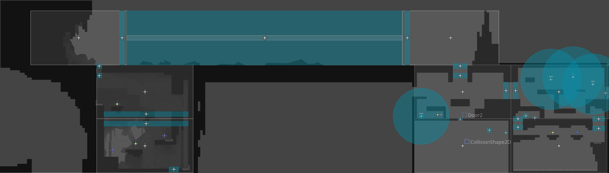

# The title of your game #

## Summary ##

**A paragraph-length pitch for your game.**

## Project Resources

[Web-playable version of your game.](https://itch.io/)  
[Trailor](https://youtube.com)  
[Press Kit](https://dopresskit.com/)  
[Proposal: make your own copy of the linked doc.](https://docs.google.com/document/d/1qwWCpMwKJGOLQ-rRJt8G8zisCa2XHFhv6zSWars0eWM/edit?usp=sharing)  

## Gameplay Explanation ##

**In this section, explain how the game should be played. Treat this as a manual within a game. Explaining the button mappings and the most optimal gameplay strategy is encouraged.**


**Add it here if you did work that should be factored into your grade but does not fit easily into the proscribed roles! Please include links to resources and descriptions of game-related material that does not fit into roles here.**

# External Code, Ideas, and Structure #

If your project contains code that: 1) your team did not write, and 2) does not fit cleanly into a role, please document it in this section. Please include the author of the code, where to find the code, and note which scripts, folders, or other files that comprise the external contribution. Additionally, include the license for the external code that permits you to use it. You do not need to include the license for code provided by the instruction team.

If you used tutorials or other intellectual guidance to create aspects of your project, include reference to that information as well.

# Team Member Contributions

This section be repeated once for each team member. Each team member should provide their name and GitHub user information.

The general structures is 
```
Team Member 1
  Main Role
    Documentation for main role.
  Sub-Role
    Documentation for Sub-Role
  Other contribtions
    Documentation for contributions to the project outside of the main and sub roles.

Team Member 2
  Main Role
    Documentation for main role.
  Sub-Role
    Documentation for Sub-Role
  Other contribtions
    Documentation for contributions to the project outside of the main and sub roles.
...
```

For each team member, you shoudl work of your role and sub-role in terms of the content of the course. Please look at the role sections below for specific instructions for each role.

Below is a template for you to highlight items of your work. These provide the evidence needed for your work to be evaluated. Try to have at least four such descriptions. They will be assessed on the quality of the underlying system and how they are linked to course content. 

*Short Description* - Long description of your work item that includes how it is relevant to topics discussed in class. [link to evidence in your repository](https://github.com/dr-jam/ECS189L/edit/project-description/ProjectDocumentTemplate.md)

Here is an example:  
*Procedural Terrain* - The game's background consists of procedurally generated terrain produced with Perlin noise. The game can modify this terrain at run-time via a call to its script methods. The intent is to allow the player to modify the terrain. This system is based on the component design pattern and the procedural content generation portions of the course. [The PCG terrain generation script](https://github.com/dr-jam/CameraControlExercise/blob/513b927e87fc686fe627bf7d4ff6ff841cf34e9f/Obscura/Assets/Scripts/TerrainGenerator.cs#L6).

You should replay any **bold text** with your relevant information. Liberally use the template when necessary and appropriate.

Add addition contributions int he Other Contributions section.
# Long Phanguyen
## Sub-Roles ##
## Other Contributions ##
# Atticus Wong
## Main Roles ##
Game Logic/Player Logic

1. Tile effects - I wrote the logic for the [effects that colors have on players and game objects](https://github.com/HimeWoo/untitled-paint-game/blob/main/untitled-paint-game/scripts/paintable.gd). There are 6 different colors: Red, Blue, Yellow, Green, Orange, and Purple. The tiles have 7 different custom data layer properties that outline what effect they give, and those properties determine their use cases. Also worked with Sandeep on hazard logic, specifically for [spikes](https://github.com/HimeWoo/untitled-paint-game/blob/3b529450887376ad92005a401f9b101cc918af89/untitled-paint-game/scripts/player.gd#L744C1-L757) and player interactions. Originally, [spikes and the spike logic were created as a separate scene](https://github.com/HimeWoo/untitled-paint-game/blob/3b529450887376ad92005a401f9b101cc918af89/untitled-paint-game/scripts/player.gd#L698-L724), which made it difficult to level design. I migrated spike logic to be based on tiles, which included migrating hazard logic to take effect on specific tiles via another custom data layer. This eases the processes of level designing.
2. Player movement - I wrote the core logic for the player movement. The player has a [directional melee attack](https://github.com/HimeWoo/untitled-paint-game/blob/3b529450887376ad92005a401f9b101cc918af89/untitled-paint-game/scripts/player.gd#L686-L692) and a dash. Took movement inpsiration from hollow knight, with a little bit of added momentum to specific movements like the dash to keep player feel in line with puzzle design.
3. Melee attacks + player/tile interactions - The player has access to paint the world via an inventory and canvas/selected paints. With their melee attack, they can [apply different paints onto specific paintable tiles](https://github.com/HimeWoo/untitled-paint-game/blob/main/untitled-paint-game/scripts/melee_attack.gd) to give themselves various effects and change the environment around them. the _physics_process [checks which tile the player is currently standing on](https://github.com/HimeWoo/untitled-paint-game/blob/3b529450887376ad92005a401f9b101cc918af89/untitled-paint-game/scripts/paintable.gd#L33-L42) and applies the effect accordingly
4. [Pushboxes](https://github.com/HimeWoo/untitled-paint-game/blob/main/untitled-paint-game/scripts/pushbox.gd), [pressure plates](https://github.com/HimeWoo/untitled-paint-game/blob/main/untitled-paint-game/scripts/pressure_pad.gd), and [doors](https://github.com/HimeWoo/untitled-paint-game/blob/main/untitled-paint-game/scripts/door.gd) - players can interact with moveable pushbox objects that can be used to reach greater heights and open doors. Pressure plates are only used to open doors, and each pressure plate references a door via an exported `linked_door` variable that's easily accessible via the godot editor.
## Sub-Roles ##
1. Animations - I implemented a bunch of the assets created by jason for QOL improvements, specifically animations for the [player](https://github.com/HimeWoo/untitled-paint-game/blob/3b529450887376ad92005a401f9b101cc918af89/untitled-paint-game/scenes/player.tscn#L237-L240) and enemies ([ground](https://github.com/HimeWoo/untitled-paint-game/blob/3b529450887376ad92005a401f9b101cc918af89/untitled-paint-game/scenes/GroundEnemy.tscn#L48-L51) and [floating](https://github.com/HimeWoo/untitled-paint-game/blob/3b529450887376ad92005a401f9b101cc918af89/untitled-paint-game/scenes/FloatingEnemy.tscn#L48-L51) enemies)
2. World and level designing - I worked alongside Long to build some of the rooms for the metroidvania feel that we were going for. I built and design 6 of the rooms using the components built by this goated team (like camera transitions and tiles).

## Other Contributions ##
# Sandeep
## Sub-Roles ##
## Other Contributions ##
# Jason Xie
## Sub-Roles ##
## Other Contributions ##
# Adrean Cajigas
## Sub-Roles ##
## Other Contributions ##
# Alex Ogata
## Main Roles ##
User Interface and Input

* Player Inventory - I implemented the player's [inventory system](https://github.com/HimeWoo/untitled-paint-game/blob/5fb55f15016b792750bc84c6ddda936302d1c153/untitled-paint-game/scripts/inventory.gd). The player has a starting total of four inventory slots that can carry any primary color of paint. The inventory system allows for easy access to the underlying data structure, while sending signals which update the inventory's interface. 
* Paint Selector - I implemented the player's [paint selector](https://github.com/HimeWoo/untitled-paint-game/blob/5fb55f15016b792750bc84c6ddda936302d1c153/untitled-paint-game/scripts/paint_selector.gd). The paint selector allows the player to choose existing colors from their inventory and add them to a "palette". The player can select different slots on their palette to imbue their attacks with different colors. The player can [mix colors together](https://github.com/HimeWoo/untitled-paint-game/blob/5fb55f15016b792750bc84c6ddda936302d1c153/untitled-paint-game/scripts/paint_color.gd#L15) and confirm the mixture to remove the component colors from the player's inventory .
* Items - I added [paint items](https://github.com/HimeWoo/untitled-paint-game/blob/5fb55f15016b792750bc84c6ddda936302d1c153/untitled-paint-game/scripts/world_item.gd) that can be placed in the world for the player to pick up. There exist paint items in the colors [red](https://github.com/HimeWoo/untitled-paint-game/blob/5fb55f15016b792750bc84c6ddda936302d1c153/untitled-paint-game/scenes/items/red_paint.tscn), [blue](https://github.com/HimeWoo/untitled-paint-game/blob/5fb55f15016b792750bc84c6ddda936302d1c153/untitled-paint-game/scenes/items/blue_paint.tscn), and [yellow](https://github.com/HimeWoo/untitled-paint-game/blob/5fb55f15016b792750bc84c6ddda936302d1c153/untitled-paint-game/scenes/items/yellow_paint.tscn) which the player can come into contact with which will remove it from the world and add the corresponding color to the player's inventory (if there is sufficient space). The assets were drawn by me.
* Heads-up Display - I implemented the [heads-up display](https://github.com/HimeWoo/untitled-paint-game/blob/5fb55f15016b792750bc84c6ddda936302d1c153/untitled-paint-game/scenes/ui/interface.tscn) for our game. The interace updates according to the player's inventory to give the user a visual description of the different paint the player has picked up, in addition to how much inventory space is left. The interface includes a display of the aformentioned paint selector and which slot is highlighted. I included a small hint for some less intuitive keybinds in the top right.
* Controls - I added the methods for the [player's controls](https://github.com/HimeWoo/untitled-paint-game/blob/5fb55f15016b792750bc84c6ddda936302d1c153/untitled-paint-game/scripts/player.gd#L353) that involved the inventory or paint selector. The player uses the I, O, and P keys to add red, blue, or yellow paint, respectively, to the paint selector, given that it exists in the player's inventory. The player can clear the selected slot using the R key, refunding paint that the player has not confirmed to mix. The player can use the ENTER key to confirm to mix paint. The player can use the Q and E keys to navigate the paint selector.

## Sub-Roles ##
Level Design

* Room Transitions - I added [room transitions](https://github.com/HimeWoo/untitled-paint-game/blob/5fb55f15016b792750bc84c6ddda936302d1c153/untitled-paint-game/scripts/room_transition.gd) that controls the position of the camera when moving between rooms. They allow for customization of the camera's target and the camera's zoom.
* Camera Zoom Lerping - I added [lerp](https://github.com/HimeWoo/untitled-paint-game/blob/5fb55f15016b792750bc84c6ddda936302d1c153/untitled-paint-game/scripts/camera.gd) when changing the camera's zoom. This is primarily designed for use with the room transitions.
* Level Decoration - I decorated the [main level](https://github.com/HimeWoo/untitled-paint-game/blob/5fb55f15016b792750bc84c6ddda936302d1c153/untitled-paint-game/scenes/World.tscn) with the tile variations supplied by Jason and following the layout of the level designed by Long. 

## Other Contributions ##
* I created the assets that are used for the paint items and the paint icons in the player's inventory.
